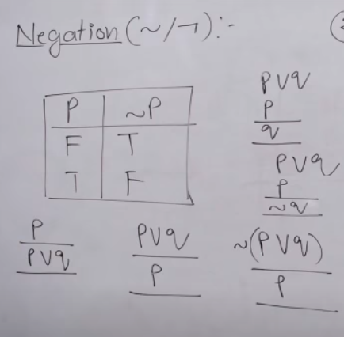

# 1. What is a Proposition?
Any statement that is either true or false, is termed as proposition.

There are two laws regarding proposition as follows:
#### - Law of excluded middle
This law states that a proposition is required to be either true or false but not both.

#### - Law of contradiction
```
True = not False
False = not True
```

## 2. Types of proposition:

#### - Atomic Proposition
Any proposition which cannot be further divded is termed as atomic proposition.

#### - Compund Proposition
One or more atomic proposition combined to form a compound proposition using **connectors/operators** (i.e ~, ^, v, ->, <->).

**Note**:- `Both atomic and compund Proposition's are generally termed as Premises`.

## 3. What is Argument?
Collection of Premises on the basis of which we derive a conclusion is termed as Argument.


## 3. Connectors / Operators

### a. Negation (~)
>It is a NOT of digital electronics.



### b. Disjunction (v)
>It is a OR of digital electronics.


### c. Conjunction (^)
>It is AND of Digital Electronics


### d. Implication (->)
>It is also an binary operator. P -> Q, is read as **If P then Q**.

With truth table as follows:


P -> Q = ~p v Q ``If P then Q is equal to Not P OR Q``

## 5. Converse, Inverse & Contrapositive


## Types of Propositions WRT their logical structure
#### - Tautology
A propositional function which is true in every possible case. A tautology is also termed as Valid statement.

#### - Contradiction
A propositional function which is false in every possible case.

#### - Contingency
A propositional function which is some time true and sometime false.

## 6. Satisfiability
A statement or a propsoition is said to be satisfiable if its truth table has **atleast one true value**, otherwise statement is unsatisfiable.

`Clearly, Tautology and Contingency are satisfiable whereas Contradiction is unsatisfiable.`
